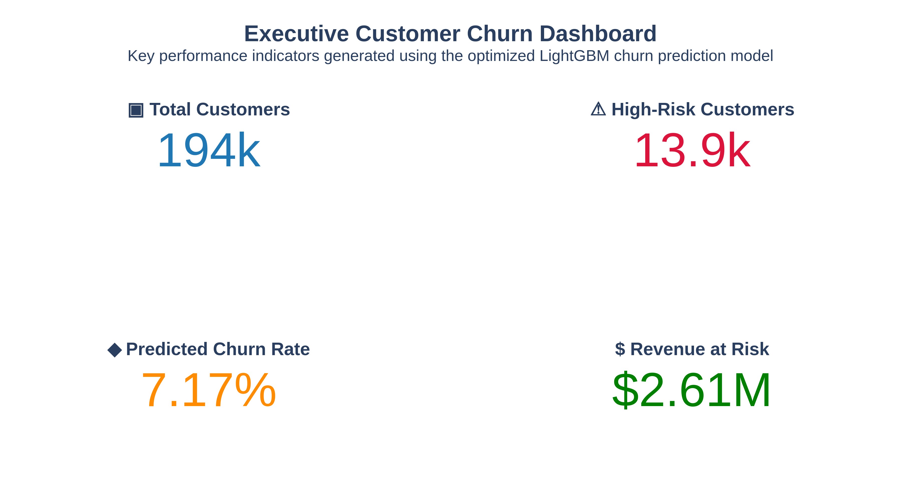
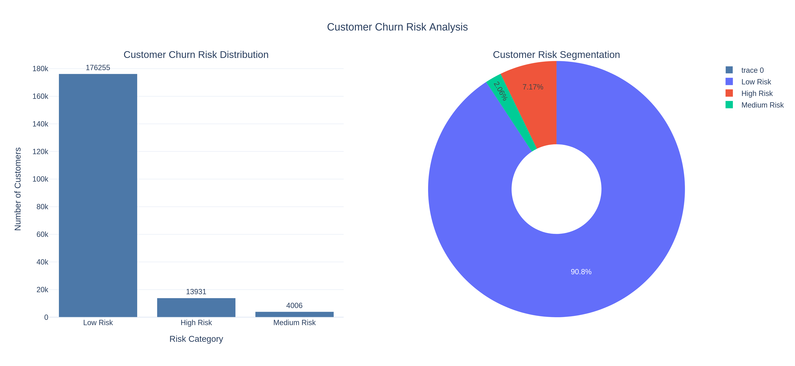
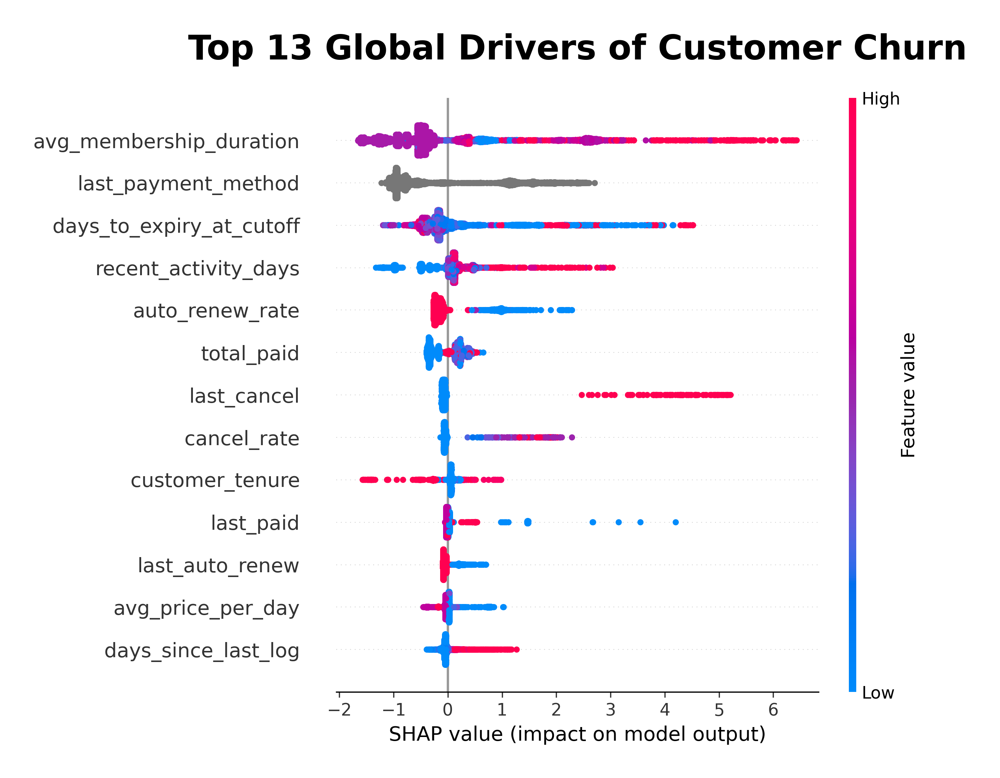
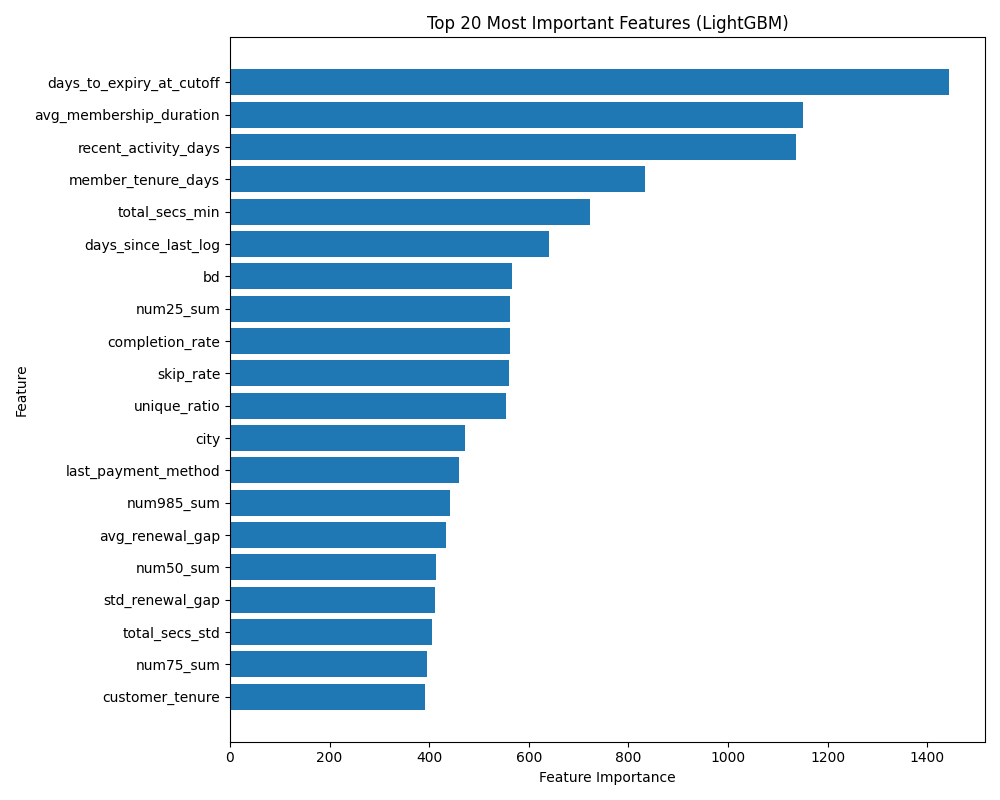

# KKBOX Customer Churn Prediction

> End-to-end customer churn prediction using advanced feature engineering, LightGBM, SHAP explainability, and business intelligence to identify high-risk customers and support data-driven retention strategies.>

## Overview

This project develops an end-to-end machine learning solution for predicting customer churn using the KKBOX subscription dataset. The project combines advanced feature engineering, gradient boosting models, SHAP explainability, and business intelligence to identify high-risk customers and generate actionable retention strategies.

The objective is not only to build an accurate predictive model but also to transform model predictions into business insights that can help reduce customer churn and improve customer lifetime value.

## Dataset

This project uses the KKBOX Customer Churn Prediction dataset from Kaggle.

The project combines information from four primary datasets:
| Dataset              | Description                                                                   |
| -------------------- | ----------------------------------------------------------------------------- |
| **train.csv**        | Target dataset containing customer IDs and churn labels.                      |
| **members.csv**      | Customer demographic information and registration details.                    |
| **transactions.csv** | Subscription plans, payments, renewals, cancellations, and pricing history.   |
| **user_logs.csv**    | Daily music listening activity, including play counts and listening duration. |


These datasets were merged through extensive feature engineering to create a customer-level dataset containing behavioral, subscription, payment, and engagement features for machine learning.

## Problem Statement

Customer churn is one of the biggest challenges for subscription-based businesses.

The goal of this project is to build a machine learning model capable of identifying customers who are most likely to cancel their subscription before churn actually occurs.

The resulting predictions enable businesses to:

- Target retention campaigns efficiently
- Reduce customer acquisition costs
- Increase customer lifetime value
- Improve marketing ROI

## Technologies Used

- Python
- Polars
- Pandas
- Scikit-learn
- LightGBM
- CatBoost
- XGBoost
- Optuna
- SHAP
- Plotly
- Matplotlib

## 📊 Project Workflow

1. Data Collection
2. Data Cleaning
3. Feature Engineering
4. Model Training
5. Hyperparameter Optimization (Optuna)
6. Model Evaluation
7. Business Intelligence Dashboard
8. Business Insights
9. Business Recommendations
10. SHAP Explainability

## 📁 Repository Structure

```text
kkbox-customer-churn-prediction/
│
├── 01_kkbox_feature_engineering.ipynb
├── 02_model_training.ipynb
├── 03_business_intelligence.ipynb
├── lightgbm_final_model.pkl
├── KKBOX_Business_Intelligence_Report.pdf
├── images/
│   ├── executive_dashboard.png
│   ├── feature_importance.png
│   ├── risk_distribution.png
│   └── shap_summary.png
└── README.md
```
## Model Performance

Several machine learning models were developed and evaluated.

| Model               | Purpose                     |
| ------------------- | --------------------------- |
| Logistic Regression | Baseline model              |
| CatBoost            | Gradient boosting benchmark |
| XGBoost             | Gradient boosting benchmark |
| **LightGBM**        | **Final production model**  |

The optimized LightGBM model achieved the best predictive performance and was selected for business analysis.

Performance was evaluated using:

- ROC-AUC
- Precision
- Recall
- F1-score
- Confusion Matrix

## Feature Engineering Highlights

The project engineers customer-level features from subscription transactions, membership records, and user listening logs, including:

- Customer tenure
- Average membership duration
- Renewal frequency and consistency
- Payment and discount trends
- Cancellation behavior
- Subscription pricing history
- Days since last activity
- Average listening time per day
- Average plays per day
- Music listening behavior (completion rate, skip rate, and unique song ratio)

These engineered features transformed raw transactional and behavioral data into meaningful predictors that substantially improved the performance of the churn prediction models.

## Key Business Insights

### Major findings include:

- Customer behavior is a stronger predictor of churn than demographic information.
- Membership duration is the strongest indicator of customer loyalty.
- Recent payment activity strongly influences churn risk.
- Customers approaching subscription expiration have significantly higher churn probability.
- Frequent cancellations and inconsistent renewals are major warning signals.
- Customer engagement is one of the most valuable retention indicators.

## Business Recommendations

### Based on the analysis, businesses should:

- Prioritize retention campaigns for high-risk customers.
- Offer renewal incentives before subscription expiration.
- Monitor customers with declining engagement.
- Encourage Auto-Renew adoption.
- Detect cancellation patterns early.
- Personalize retention offers using churn probability scores.

## Sample Visualizations

### Executive KPI Dashboard

**Note:** The Revenue at Risk metric is an illustrative estimate based on an assumed average monthly subscription value of $149 per customer.


---

### Customer Risk Distribution


---

### SHAP Summary Plot


---

### Feature Importance


## Reproducibility

This project uses the **KKBOX Customer Churn Prediction Challenge** dataset from Kaggle.

Due to the dataset size (over 9 GB) and Kaggle competition licensing, the raw data is not included in this repository. To reproduce the project, download the dataset from the Kaggle competition and run the notebooks in numerical order.
